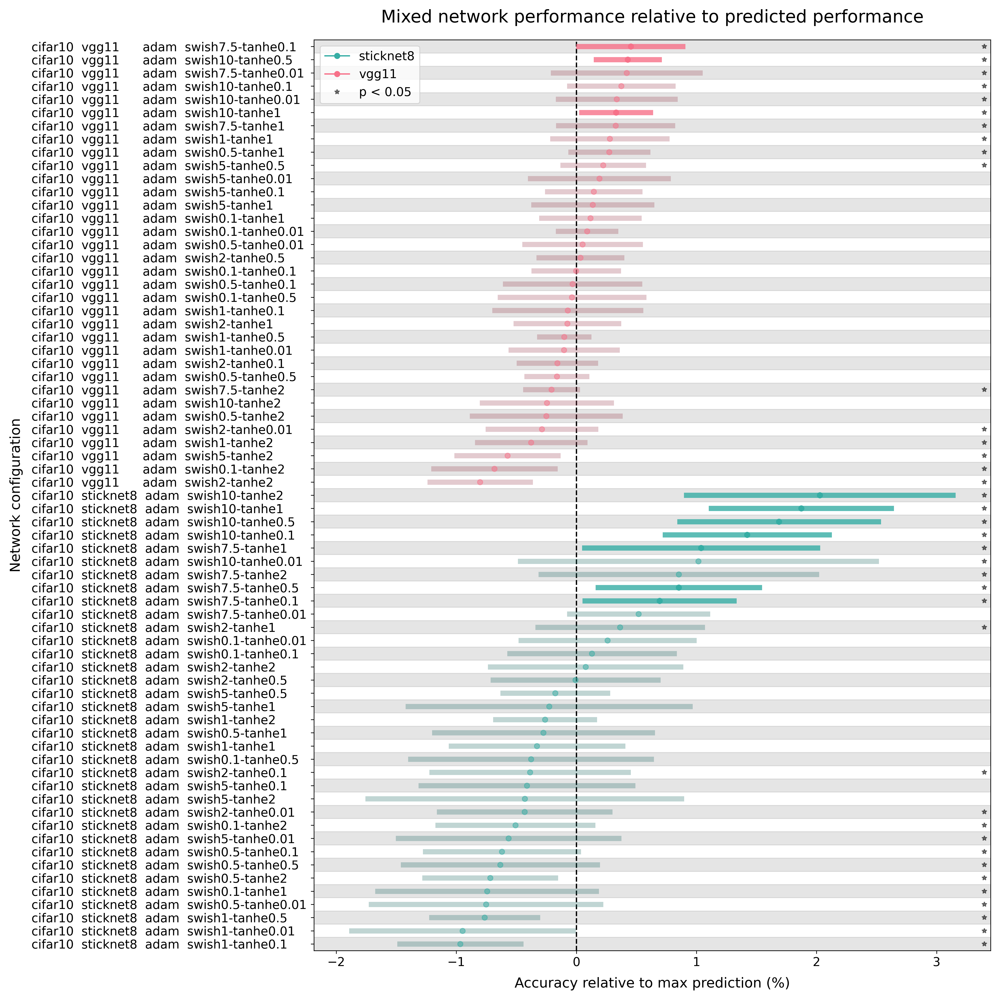

# allen-inst-cell-types

My repo for researching the effects of adding mixed nonlinearities to Pytorch CNNs to try answering the question "Does the addition of neuronal cell types to artificial deep networks have a measurable effect on their feed-forward processing?"

### Requirements
[PyTorch](https://github.com/pytorch/pytorch)

[torchvision](https://github.com/pytorch/vision)

### Acknowledgments
- Dr. Alex Piet (Allen Institute for Brain Science)
- [Allen Institute Summer Internship Program](https://alleninstitute.org/careers/internships/)
- UW/Allen Cell Types research group

